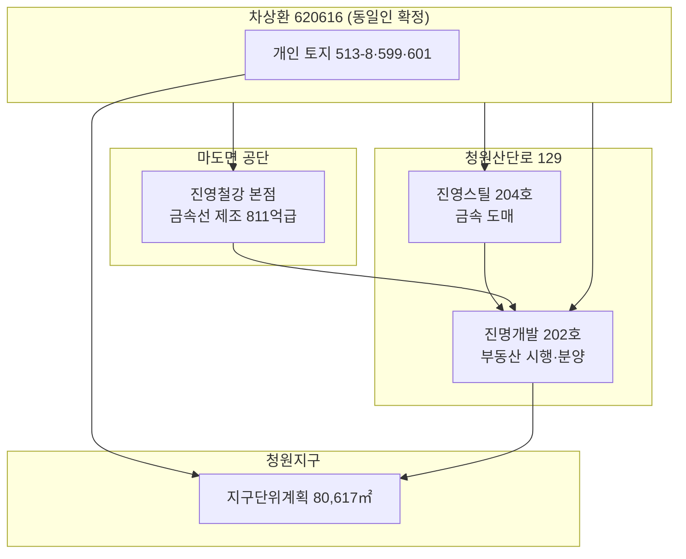

# 차상환 — 동일인·관련 법인 조사 보고서

**작성일** 2026. 7. 3. | **대상** 진명개발(주)·진영철강(주)·진영스틸(주) 및 청원지구 토지·공개 DB | **목적** 「차상환」 동일인 여부 및 관련 법인·토지·권역 교차 확인 | **작성** 삼아건설(주)

> **핵심 결론.** 등기상 **생년월일(620616·1962. 6. 16.)** 과 **주소(안산 보네르빌리지)** 가 **진명개발(주)와 진영철강(주)에서 일치** → **동일인 확정**. **진명개발(주) 공동대표 차상환** = **진영철강(주) 대표이사 차상환** — [진영철강 홈페이지](http://www.jinyoungsteel.co.kr/) 공개 대표자명과 일치. 진영스틸(주)은 등기 PDF 미보유·생년 미기재이나 **동일 건물·동시기 설립·동명 대표**로 **동일인 가능성 매우 높음**(강함).

## Ⅰ. 동일인 판정

| 항목 | 진명개발(주) | 진영철강(주) | 판정 |
| --- | --- | --- | --- |
| 성명 | 차상환 | 차상환 | 일치 |
| 생년월일(등기) | **620616-******* | **620616-******* | **일치 → 동일인** |
| 등기상 주소 | 경기도 안산시 단원구 안산천남로 211, 101동 701호(고잔동, 보네르빌리지) | 동일(대표이사 주소·2011. 11. 28. 변경 등기) | 일치 |
| 청원지구 권역 | 본점 **청원산단로 129** | 본점 **마도공단로6길 11**(마도면) | **동일·인접 권역** |

**동명이인 배제.** 「620616」 앞 6자리는 등기 고유 식별에 쓰이므로, **동명 다른 사람일 가능성은 실무상 배제**한다.

## Ⅱ. 법인별 임원·역할 (등기 기준)

### 1. 진명개발 주식회사

근거: `진명개발(주)_법인등기부등본.pdf` · 열람 2026. 6. 18.

| 구분 | 성명 | 생년(등기) | 현재 역할·변동 |
| --- | --- | --- | --- |
| **차상환** | 620616 | **공동대표이사** · 2026. 1. 10. 중임(2026. 1. 12. 등기) |
| | | 2024. 7. 16.~2026. 1. 9. **사내이사**(공동대표 사임) · **2026. 1. 10. 공동대표 복귀** |
| **김성진** | 670702 | **공동대표이사** · 2024. 7. 16. 취임 · 2026. 1. 10. 중임 |
| 진종덕 | 610412 | 전 공동대표·사내이사 · 2024. 7. 16. 사임 |
| 노효설 | 640105 | 전 사내이사 · 2024. 10. 15. 사임 |

**현재.** **공동대표이사 차상환·김성진 2인** — 신탁계약서(2026. 1. 8.)·등기 중임(2026. 1. 10.) 대조.

| 항목 | 내용 |
| --- | --- |
| 법인등록번호 | 134811-0724593 |
| 사업자등록번호 | 839-87-02917 |
| 본점 | 화성시 만세구 마도면 **청원산단로 129**, 상가 1동 202호 |
| 설립 | 2023. 1. 10. |
| 사업목적 | 부동산 개발·매매·임대·**시행·분양** 등 |

### 2. 진영철강 주식회사

근거: `진영철강(주)_화성.pdf` · `진영철강(주)_안산.pdf` · 열람 2026. 7. 3.

| 구분 | 성명 | 생년(등기) | 현재 역할·변동 |
| --- | --- | --- | --- |
| **차상환** | 620616 | **대표이사** · 2017. 7. 11. 취임 · 2020·2023. **중임** |
| | | 2002~2017. 대표이사(안산·화성) · 2017. 6. 30. 사임 후 **대표이사 재취임** |
| **김민영** | (등기상 사내이사) | 2017. 7. 11. 취임 |
| 차종수 | 300812 | **전 감사** · 2002. 12. 18. 취임 · 2014. 3. 31. **퇴임** |

| 항목 | 내용 |
| --- | --- |
| 법인등록번호 | 135511-0134226 |
| 사업자등록번호 | 134-81-94076 |
| 본점 | 화성시 마도면 **마도공단로6길 11** |
| 지점 | 충주시 대소원면 첨단산업2로 127 |
| 설립 | 2002. 12. 18. · 2011. 8. 9. 안산→화성 마도면 이전 |
| 자본금 | 5억 5,000만원 |
| 사업 | 금속선·파스너·나사 제조·도소매 · **부동산·기계 임대**(2017. 목적 변경) |
| **홈페이지** | [http://www.jinyoungsteel.co.kr/](http://www.jinyoungsteel.co.kr/) — **대표 차상환** · 냉간압조용 강선·소둔선 · 화성·충주 공장 |
| 주의 | 열람 시 **법인변경등기 처리 중**(수원지방법원 등기국 제490187호) |

**공개 재무(인크루트·나이스디앤비 집계, 2025 결산).** 매출 약 **811억** · 순이익 약 **51억** · 자본총계 약 **259억** · 재직 약 **31명** — 신용보고서 정본 아님·참고용.

### 3. 진영스틸 주식회사 (신규 확인)

근거: 국세청·근로복지공단 공개 API(씬디스 [293-86-02905](https://seenthis.kr/page/index?b_no=2938602905)) · 2026. 7. 3. 조회

| 항목 | 내용 |
| --- | --- |
| 상호 | 진영스틸주식회사 |
| 사업자등록번호 | 293-86-02905 |
| **본점** | 화성시 마도면 **청원산단로 129, 204호** |
| 업종 | 1차 금속제품 도매업 |
| 고용보험 | 2023. 2. 6. 가입 · 임직원 1명(고용)·산재 2명 |
| **진명개발과** | **동일 건물**(129) · **202호 vs 204호** · 진명개발(2023. 1. 10.) 직후 설립 |
| **동일인** | 등기 미열람 · **차상환** 대표(공개 DB) · **620616과 동일인 가능성 매우 높음** |

**「진영」 계열 명칭.** 진영**철강**·진영**스틸**·진명**개발**(차상환 계열) — 철강·금속·부동산 시행이 **한 권역·한 건물**에 모여 있음.

## Ⅲ. 개인 토지(청원지구 인접) — 토지조서 교차

근거: 청원지구 토지조서 · 정부24 대장 2026. 6.~7.

| 지번 | 면적(㎡) | 소유 | 취득일 | 공시지가 합(원) | 비고 |
| --- | --- | --- | --- | --- | --- |
| 513-8 | 2,715 | **차상환 외 1인** | 2026. 1. 8. | 216,657,000 | 2026. 3. 27. 분할 · 도로 편입 일부 |
| 599 | 807 | **차상환** | 2024. 10. 30. | 83,928,000 | 구역 서·북측 전답 |
| 601 | 767 | **차상환** | 2026. 2. 19. | 76,393,200 | 구역 동·북측 전답 |
| **합계** | **4,289** | | | **약 3.77억(공시)** | 진명개발 법인 보유(2.4만㎡)와 **별도 개인名의** |

**513-8 「외 1인」** — 공동소유자 **미확인**(등기·대장 추가 열람 필요). 진영철강 **김민영(621019)** 등과의 연관은 **근거 없음**.

## Ⅳ. 권역·사업 연결도 (요약)

## Ⅴ. 관계사·가족 추정 (등기·공개자료)

| 성명 | 생년(등기) | 관계 추정 | 근거 |
| --- | --- | --- | --- |
| **차종수** | 300812 | 진영철강 **전 감사**(2002~2014) · **차씨 성** | 등기 · **가족(父·叔 등) 가능성** · 미확인 |
| **김민영** | (사내이사) | 진영철강 사내이사 · **김성진(670702)과 동일인 아님** | 생년 상이 |
| **김성진** | 670702 | 진명개발 **공동대표** · 진영철강 임원 **아님** | 등기 |

## Ⅵ. 확인 불가·추가 열람 권장

| 항목 | 이유 | 확인처 |
| --- | --- | --- |
| 진영스틸 **동일인 정본** | 등기 PDF 없음 | 인터넷등기소 — **진영스틸주식회사** 등기 |
| **주주·지분** (진명↔진영) | 주주명부 비공개 | 등기 **발급용**·NICE/KIS 기업보고서 |
| 513-8 **공동소유자** | 대장 「외 1인」만 | 정부24 **등기사항증명서** |
| 진영철강 **변경등기 완료본** | 제490187호 처리 중 | `진영철강(주)_화성.pdf` **재열람** |
| 차상환 **타 법인** | 공개 DB는 대표명만 | KED·NICE **경영진·관계사** 항목 |
| **동명 타인** | 강릉 솔향냉동공조·영은시스템 등 **별인** | 생년·주소 **불일치** → 본 조사 **제외** |

## Ⅶ. 본 프로젝트 시사점

1. **시행 주체 추정 강화** — 진명개발 본점이 사업지와 일치하고, **동일인(620616)이 진영철강 대표·청원지구 인접 토지 보유** → **차상환 계열이 청원지구·철강·금속 밸류체인에 직접 관여**하는 구조.
2. **PF·하도급 실사** — 진영철강(제조·매출 800억급)과 진명개발(시행·3억 자본)은 **규모·업종이 다름** · **지분·자금 연결은 등기만으로 미확인**.
3. **대표권** — **진명개발 공동대표 차상환·김성진 2인**(2026. 1. 10.~) · 차상환은 **동시에 진영철강 대표이사** — 계약·공문 **서명 권한·이해충돌** 확인 필요.

## Ⅷ. 출처

1. 등기사항전부증명서 — 진명개발 주식회사, 등기번호 091631, 열람 2026. 6. 18. (`진명개발(주)_법인등기부등본.pdf`)
2. 등기사항전부증명서 — 진영철강 주식회사, 등기번호 098591, 열람 2026. 7. 3. (`진영철강(주)_화성.pdf`)
3. 등기사항전부증명서(폐쇄) — 진영철강, 등기번호 015616, 열람 2026. 7. 3. (`진영철강(주)_안산.pdf`)
4. 청원지구 토지조서 — 차상환 필지 513-8·599·601
5. 씬디스 공공 API — [진명개발 839-87-02917](https://seenthis.kr/page/index?b_no=8398702917) · [진영철강 134-81-94076](https://seenthis.kr/page/index?b_no=1348194076) · [진영스틸 293-86-02905](https://seenthis.kr/page/index?b_no=2938602905)
6. [진영철강 홈페이지](http://www.jinyoungsteel.co.kr/) · [인크루트 기업정보](https://www.incruit.com/company/8164692/)

**면책.** 생년월일은 등기 열람본에서 확인한 **앞 6자리**만 기재(뒷자리 마스킹). 열람용 등기는 법적 효력 없음. 동명 타 법인·개인과 혼동 금지.

화성 청원지구 · 차상환 동일인 조사 — 2026. 7. 3. 삼아건설(주) 작성. 끝.
